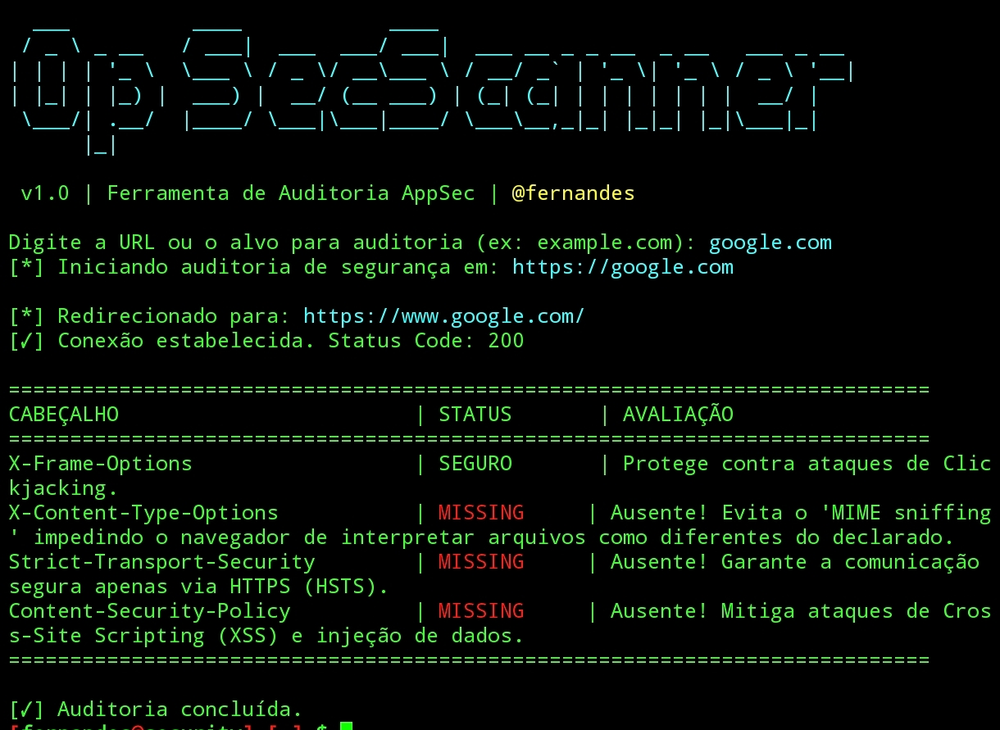

<p align="center">
  <h1 align="center">🥷 AppSec Scanner</h1>
</p>

<p align="center">
  <b>Utilitário avançado de auditoria e segurança para aplicações web.</b>
</p>

<p align="center">
  <a href="https://github.com"></a>
  <a href="https://github.com"></a>
  <a href="https://github.com"></a>
</p>

---

O **AppSec Scanner** é uma ferramenta desenvolvida em Python para análise e verificação rápida de cabeçalhos de segurança HTTP. O script foi projetado para ser leve, rápido e ideal para auditorias em ambientes Linux e *mobile* (como Termux).

## 🗄️ Funcionalidades

- **🗃️ Auditoria Completa:** Verifica a implementação e integridade de cabeçalhos essenciais (CSP, HSTS, X-Frame-Options, etc.).
- **📟 Interface Interativa:** Saída formatada com cores e banner ASCII para fácil leitura no terminal.
- **🛡️ Tratamento de Erros Inteligente:** Detecta redirecionamentos, timeouts e erros de conexão.
- **📱 Portabilidade:** Funciona nativamente em terminais móveis e de desktop.

---

## 📷 Demonstração Visual

<p align="center">
  
</p>

---

## ⚙️ Pré-requisitos

Para executar o script, certifique-se de que você possui o **Python 3** instalado em sua máquina.

```bash
pip install requests
```
---

## 📥 Como Utilizar

Clone o repositório ou salve o script:
```bash
git clone https://github.com/Dkkkkkkkkk/appSec-Scaner/
```
```bash
cd appsec-scanner
```

Execute o script:
```bash
python3 appsec_scanner.py
```
Exemplo de uso rápido passando um alvo diretamente:
```bash
python3 appsec_scanner.py exemplo.com
```
